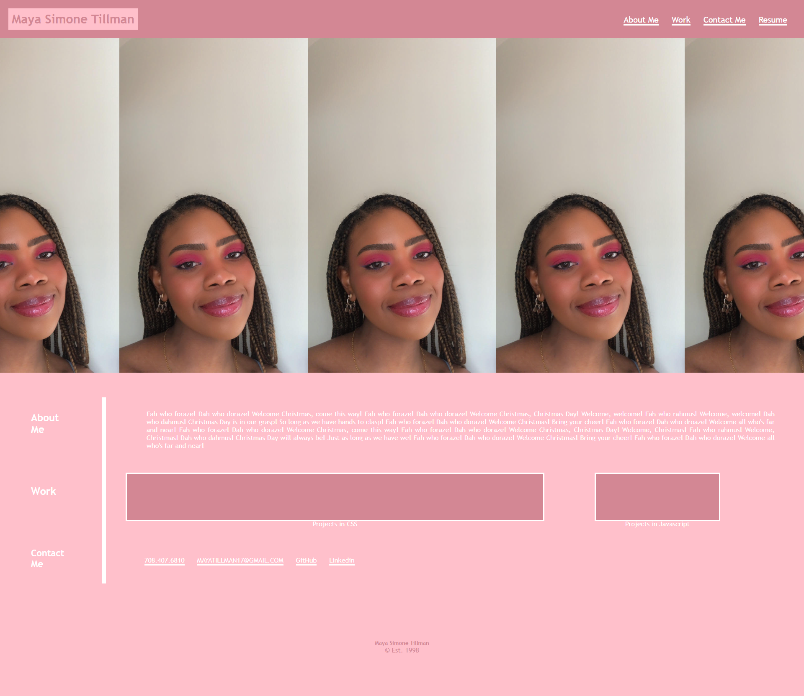

# 02 Adcanced CSS: Portfolio

## Description

The portfolio contains finished projects, and those that are in the making. The portfolio itself is very user friendly in terms of accessibility, and it contains easy navigation to optimize the experience the user.

## Screenshot

## Links to Application

- Here is the repo : [mayaatil/repo](https://github.com/mayaatil/hw2b)
- Here is the pages : [mayaatil/pages](https://mayaatil.github.io/hw2b/)
